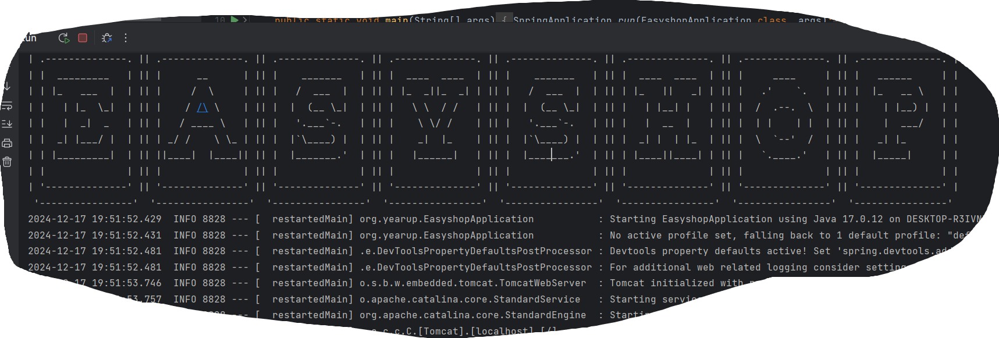
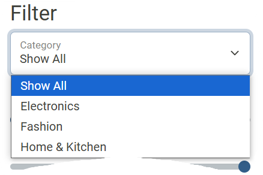
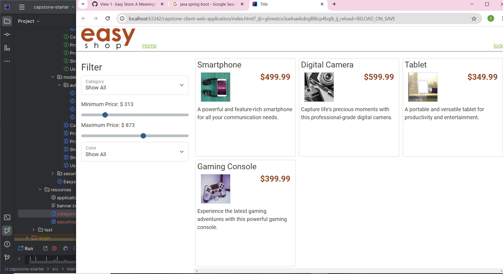
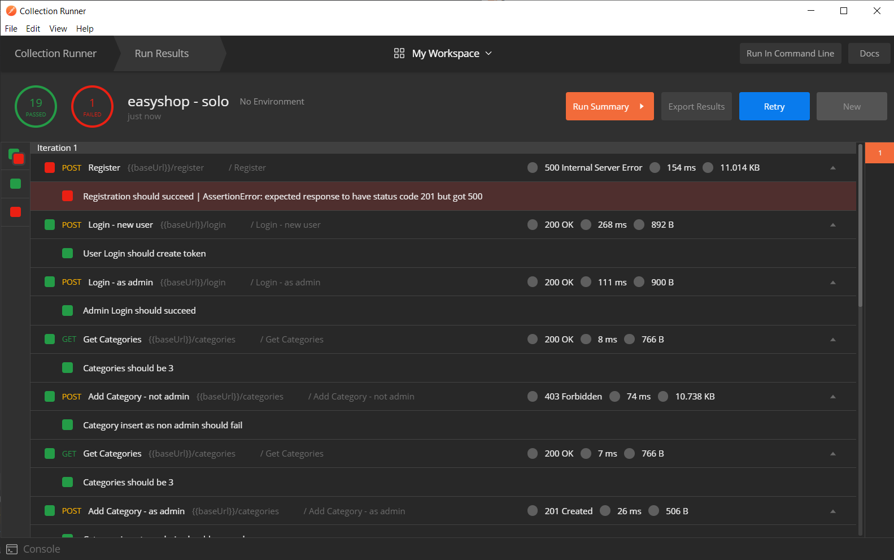
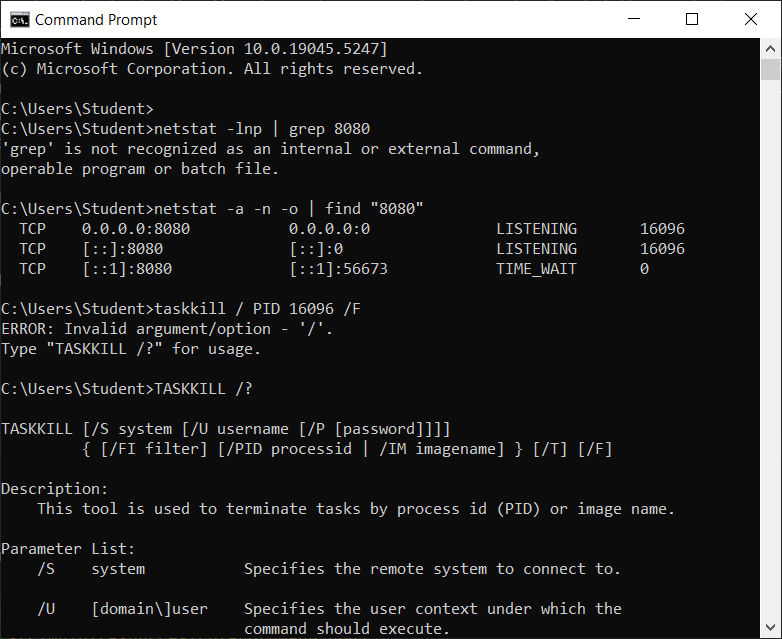

# Easy Shop: A Meaningful Name

## Description of the Project

This is application is the backend code for an e-commerce website. It interacts with a database to load inventory and is implemented with an existing front end.
A base user may filter items for purchase using the price sliders and the dropdown menu to select certain categories.
There are some features that are only available to admins, like the ability to modify, add, or delete categories.

## User Stories

List the user stories that guided the development of your application. Format these stories as: "As a [type of user], I want [some goal] so that [some reason]."

- As a user, I want the ability to retrieve all categories so that I know what is available to buy.
- As a user, I want the ability to search for a category by category ID. 
- As a user, I want the ability to search for a product by category ID.
- As an admin, I want the ability to delete a category to reflect inventory as demand changes.
- As an admin, I want the ability to update a category if changes need to be made to the category name or description.
- As an admin, I want the ability to create new categories to keep up with growth as the site expands.
- As a user, I want the results returned from a search to match the parameters I am setting to make them useful.
- As a user, I want product updates to change the original listing instead of creating a new one so that shoppers are aware of current specs and prices.

## Setup

Instructions on how to set up and run the project using IntelliJ IDEA.

### Prerequisites

- IntelliJ IDEA: Ensure you have IntelliJ IDEA installed, which you can download from [here](https://www.jetbrains.com/idea/download/).
- Java SDK: Make sure Java SDK is installed and configured in IntelliJ.

### Running the Application in IntelliJ

Follow these steps to get your application running within IntelliJ IDEA:

1. Open IntelliJ IDEA.
2. Select "Open" and navigate to the directory where you cloned or downloaded the project.
3. After the project opens, wait for IntelliJ to index the files and set up the project.
4. Find the main class with the `public static void main(String[] args)` method. This is in the class titled "EasyshopApplication".
5. Right-click on the file and select 'Run 'FinancialTracker.main()'' to start the application.
6. Download the client-web application and open in IntelliJ
7. Open website in your browser of choice

## Technologies Used

- Java: Java 17
- MySQL WorkBench
- Postman
- Spring Boot
- HTML, CSS, and JavaScript for website's frontend
- Google Chrome
- ChatGPT

## Demo

Here are some screenshots of the program in action:

## Future Work

Additional work that could be done with this project:
- Let's see how much of this I complete first...

## Resources

In addition to the material covered in class, the following tutorials and documentation were a great help to me:

- [How To Check Which Process Is Using Port 8080 ... On Windows](https://dzone.com/articles/how-to-check-which-process-is-using-port-8080-or-a)
- [Kill Whatever Is Running On Port 8080](https://superuser.com/questions/609794/kill-what-ever-is-running-on-port-8080)

## Team Members

- **Raymond Maroun** - Contributed the original files for the backend, frontend, database, and Postman tests

## Thanks

- Many thanks to Raymond, my Java bootcamp instructor, for helping me troubleshoot my update method and the rest of my category controller class.
- Thank you to Cameron. I don't remember what exactly I went to him for help for because that day was so awful I mentally blocked everything out, but I remember approaching him with my laptop and something clicked.
- Thanks to Carmen and Aaron for helping me troubleshoot and all the good times in Room 5.
- Thank you, Class 8. Working around all of you was a huge motivation. You are talented, hardworking, and hilarious, and I'm going to miss you all deeply.